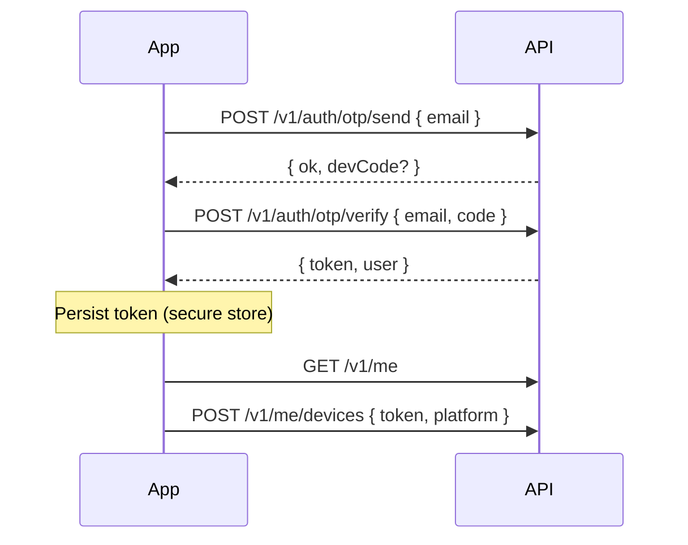
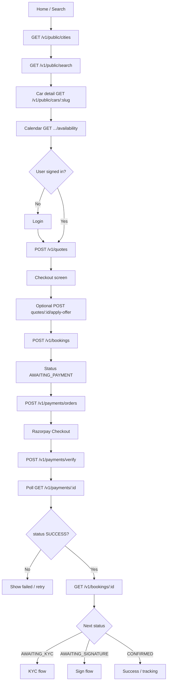
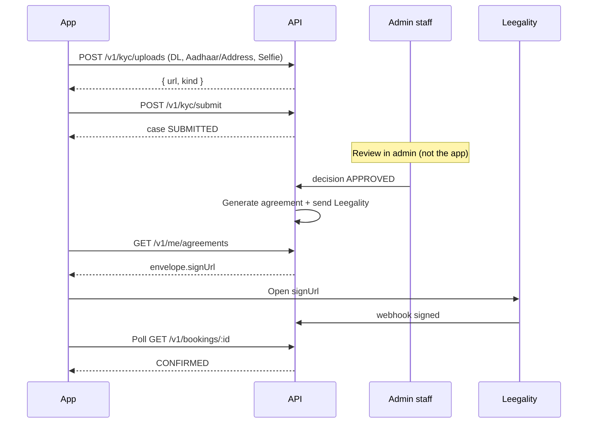

# 4. Product flows (app ↔ API)

The app never jumps a status. After each mutating call, **re-read** the booking (or listen on the socket).

Printable diagrams: [DreamDrive-App-Flows.pdf](DreamDrive-App-Flows.pdf).

---

## 4.1 Session



Alternatives: `login` / `register` (Firebase password) or `google` (`idToken`).

Phone change: `PATCH /v1/me` `{ phone }` → OTP email → `POST /v1/me/phone/verify`.

---

## 4.2 Search → quote → hold → pay (core money path)



**Hold clock:** after `POST /v1/bookings`, show ~15 minutes to pay. If the hold expires, status becomes cancelled / available again — create a **new** quote.

**Quote clock:** ~20 minutes. If `expired: true` on get-quote, restart from search/quote.

---

## 4.3 Self-drive KYC + e-sign



Reusable KYC: if `GET /v1/me/kyc` has `reusable: true`, submit with `bookingId` and **no** documents.

Rejected: show `notes`, allow re-upload of `NEEDS_REUPLOAD` kinds.

---

## 4.4 With-driver / airport / tour

Same quote → book → pay path.

- Airport: load `GET /v1/public/airports?cityId=`, send `terminalId`, `flightNumber`, `waitMinutes` on the quote.
- One-way: pick drop city/branch; server adds city-pair fee. `tripDirection: ONE_WAY`.
- Tour: `GET /v1/public/packages/:slug` then quote with `packageId`.
- Subscription: `POST /v1/subscriptions` `{ planId }` then pay the resulting booking.

KYC/sign may be skipped; success screen must still **poll booking status**, not assume `CONFIRMED`.

---

## 4.5 Track (logged in)

```
GET /v1/me/bookings
  → GET /v1/bookings/:id
  → subscribe socket + poll 8s
  → show driver name/phone when driverAssignment exists
```

## 4.6 Track (guest)

```
Enter publicId + phone
  → POST /v1/public/bookings/track/otp
  → POST /v1/public/bookings/track/verify
  → show booking (read-only)
```

Phone must already be on the customer profile (collected at register / `PATCH /v1/me`).

---

## 4.7 Cancel

Confirm copy using the table in the API contract → `POST /v1/bookings/:id/cancel` → show `refundPct` / `refundPaise` from the **response**.

Disabled when status is `HANDOVER`, `ONGOING`, or `COMPLETED`.

---

## 4.8 Support ticket

```
POST /v1/me/tickets { subject, body, bookingId? }
GET  /v1/me/tickets/:id
POST /v1/me/tickets/:id/messages
```

Poll or pull-to-refresh. Staff replies appear as messages with `internal: false`.

---

## 4.9 What the app must not do

- Compute hire price, GST, or refund % locally for charging.
- Mark payment success from Razorpay UI without `GET /v1/payments/:id` → `SUCCESS`.
- Skip quote expiry / hold expiry.
- Call admin or internal URLs.
- Store Aadhaar/PAN after submit (API stores hashes only).
- Treat WebView close as “agreement signed”.
